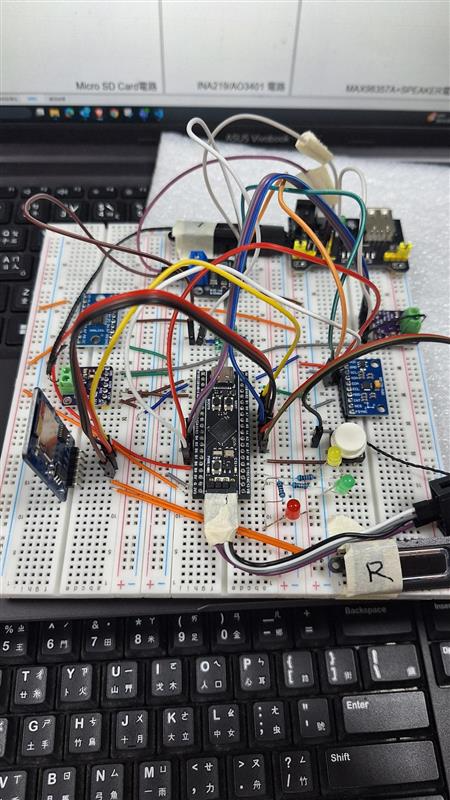
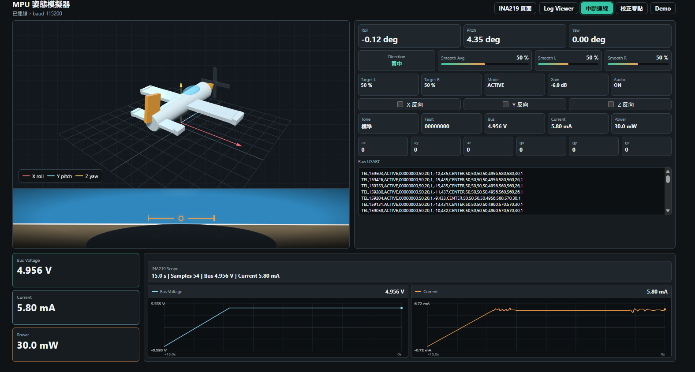
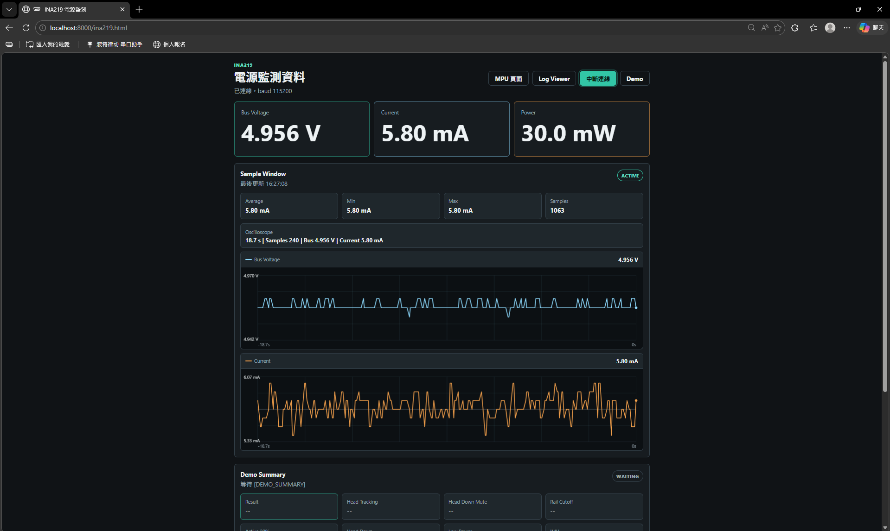
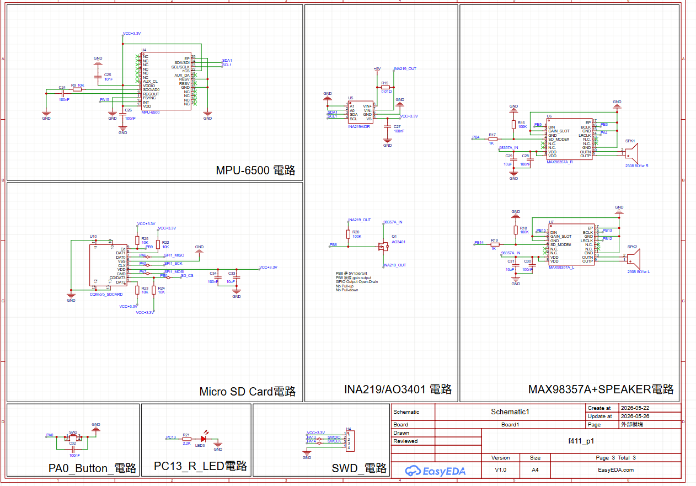
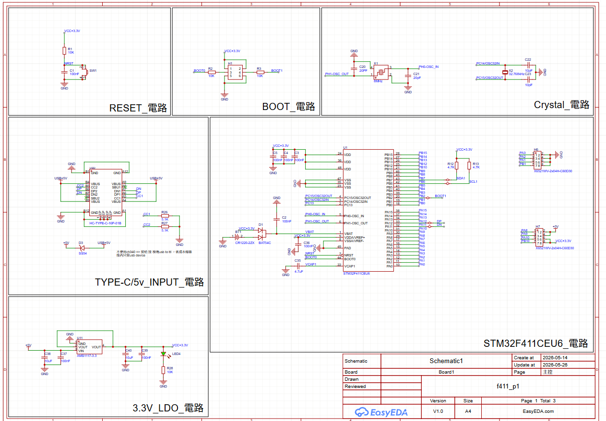
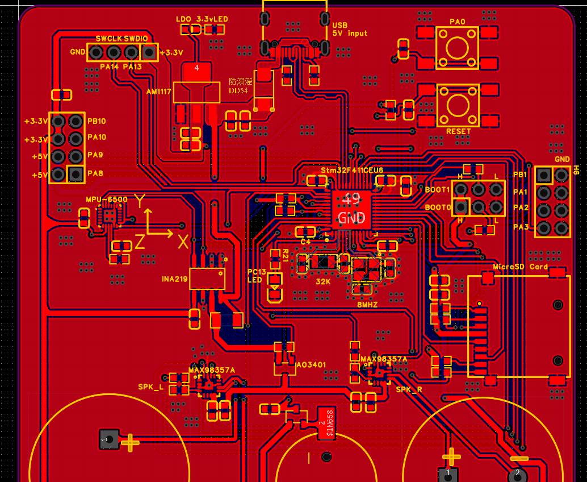
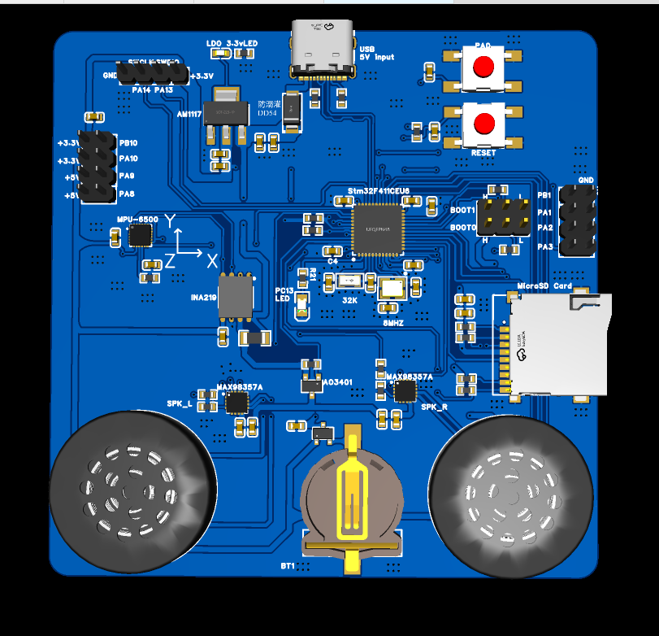

# STM32F411 頭部追蹤音訊與電源監測專案報告

## 摘要

本專案以 STM32F411CEU6 為核心，完成一套可由頭部姿態控制音訊輸出的嵌入式系統。系統讀取 MPU6500 IMU 姿態資料，計算 roll / pitch，判斷頭部方向，並透過兩組 MAX98357A I2S 擴大器輸出左右聲道音訊。同時加入按鍵模式切換、故障處理、INA219 電源監測、MicroSD CSV 紀錄、UART telemetry，以及可在桌面 HTML 頁面讀取與顯示硬體資料的測試介面。

開發流程先由 AI 輔助完成專案架構與功能設計，再使用麵包板將各模組完整接線並驗證硬體可行性。之後以 AI 輔助完成韌體模組、桌面 HTML 監測頁面與硬體通訊測試。最後進一步設計電路圖與 PCB layout，將原本以模組接線的架構轉換為直接使用 IC 與電路連接的板級設計。

## 1. 專案目標

- 建立 STM32F411 head-tracking audio 原型。
- 使用 MPU6500 偵測頭部姿態，分類 CENTER、LEFT、RIGHT、DOWN、UP。
- 依照頭部方向控制左右聲道音量與靜音行為。
- 透過 MAX98357A I2S 放大器輸出雙聲道音訊。
- 加入按鍵操作模式、LED 狀態顯示與故障保護。
- 使用 INA219 量測音訊電源軌電流，驗證低功耗控制效果。
- 使用 AO3401 控制音訊電源軌，讓 LOW_POWER 模式可真正關閉音訊供電。
- 輸出 UART telemetry 與 MicroSD CSV log，供桌面端讀取與分析。
- 完成桌面 HTML page，與硬體連線成功並驗證功能正常運作。
- 完成電路圖與 PCB layout，將麵包板模組化設計轉為可製板的電路設計。

## 2. 開發流程

### 2.1 AI 輔助設計專案

專案初期先以 AI 協助規劃系統架構，將功能拆分為感測、姿態計算、頭部狀態機、音訊控制、電源策略、資料輸出與桌面端視覺化。此階段主要決定了系統的資料流：

```text
MPU6500 I2C raw data
  -> roll / pitch calculation
  -> low-pass filter
  -> head state machine
  -> audio control / mode policy
  -> I2S DMA audio output
  -> UART telemetry + MicroSD CSV log
  -> desktop HTML page visualization
```

AI 也協助整理韌體模組邊界，讓後續開發不只是一個單一主程式，而是依照功能拆成可維護的模組，例如 `attitude.c`、`head_state_machine.c`、`audio_control.c`、`power_policy.c`、`ina219_power.c`、`data_logger.c` 與 `fault_manager.c`。

### 2.2 麵包板硬體接線

第二階段使用麵包板將全部元件接上，先驗證模組間的電氣與通訊可行性。麵包板版本包含 STM32F411、MPU6500、左右聲道 MAX98357A、INA219 / GY-219、AO3401 電源開關、MicroSD 模組、按鍵與 LED 狀態輸出。



此階段的重點是快速驗證：

- MPU6500 可透過 I2C 正常讀取。
- 左右聲道 MAX98357A 可由 I2S2 / I2S3 DMA 輸出音訊。
- INA219 可量測音訊電源軌電壓與電流。
- AO3401 可由 STM32 控制音訊電源軌開關。
- MicroSD 可透過 SPI1 與 FatFS 寫入 CSV。
- PA0 按鍵可觸發音量、靜音、低功耗與診斷模式。

### 2.3 AI 輔助完成韌體

韌體以 STM32 HAL / CubeMX 初始化為基礎，應用邏輯集中在 `App_Init()` 與 `App_MainLoop()`。根據 `code_execution_order.md` 的整理，韌體主要流程如下：

```text
Reset
  -> main()
  -> HAL / clock / peripheral init
  -> App_Init()
  -> while (1)
       -> App_MainLoop()
```

`App_Init()` 負責初始化 LED、音訊電源、姿態濾波器、系統模式、故障管理、SD logger、按鍵、音訊 DMA、MPU6500 與 INA219。`App_MainLoop()` 則以 `HAL_GetTick()` 做週期排程，處理按鍵事件、故障檢查、自動低功耗、電源監測、資料紀錄、LED 更新、IMU 讀取、姿態計算、頭部狀態更新、音訊控制與 telemetry 輸出。

韌體已完成的主要功能：

- MPU6500 I2C bring-up 與 WHO_AM_I 驗證。
- roll / pitch 計算與低通濾波。
- CENTER / LEFT / RIGHT / DOWN / UP 頭部狀態機。
- 雙 I2S DMA 音訊輸出。
- 440 Hz sine tone 測試音。
- 依 roll 控制左右聲道 panning。
- HEAD_DOWN 軟體靜音。
- 音量平滑器，降低音量跳變造成的 pop / click。
- PA0 短按與長按操作模式。
- ACTIVE、MUTED、LOW_POWER、DIAGNOSTIC、FAULT 系統模式。
- fault flags 與故障保護。
- INA219 電源監測與統計。
- AO3401 音訊電源軌切斷。
- MicroSD CSV logging。
- UART `SIM`、`SIM2`、`SIM3`、`PWR` telemetry。

## 3. 系統功能

### 3.1 姿態偵測與頭部方向判斷

MPU6500 由 I2C1 讀取加速度資料，韌體以 accelerometer 計算 roll / pitch，再透過 low-pass filter 穩定輸出。頭部狀態機依照角度門檻判斷方向，並加入 hysteresis 避免邊界抖動。

```text
LEFT  enter roll < -25 deg, exit roll > -18 deg
RIGHT enter roll >  25 deg, exit roll <  18 deg
DOWN  enter pitch < -35 deg, exit pitch > -25 deg
UP    enter pitch >  35 deg, exit pitch <  25 deg
```

### 3.2 音訊輸出與頭部控制

左右聲道分別使用兩組 I2S 與 MAX98357A：

- Left MAX98357A: I2S2
- Right MAX98357A: I2S3

roll 角度會改變左右聲道音量比例，讓頭部左右傾斜時產生 stereo panning 效果。當頭部狀態為 DOWN 時，系統會將左右聲道目標音量歸零。

```text
roll =   0 deg -> L=1.00 R=1.00
roll = -30 deg -> L=1.00 R=0.30
roll = +30 deg -> L=0.30 R=1.00

HEAD_DOWN -> L=0.00 R=0.00
MUTED     -> L=0.00 R=0.00
LOW_POWER -> audio rail off
FAULT     -> L=0.00 R=0.00
```

### 3.3 按鍵與系統模式

PA0 按鍵提供主要人機操作：

| 操作 | 功能 |
| --- | --- |
| 短按 | 切換主音量 20% / 100% |
| 長按 1 到 3 秒 | ACTIVE / MUTED 切換 |
| 長按 3 秒以上 | 進入 DIAGNOSTIC |
| LOW_POWER 中按下 | 喚醒回 ACTIVE |

系統模式與策略如下：

| Mode | IMU Rate | Telemetry | Audio Policy |
| --- | ---: | ---: | --- |
| ACTIVE | 50 Hz | 20 Hz | rail on |
| MUTED | 50 Hz | 10 Hz | software mute |
| LOW_POWER | 10 Hz | 2 Hz | rail off |
| DIAGNOSTIC | 50 Hz | 20 Hz | rail on |
| FAULT | 10 Hz | 2 Hz | forced silence |

LED 狀態顯示：

| 狀態 | LED |
| --- | --- |
| BOOT | PC13 red + PC14 green + PC15 yellow briefly on |
| ACTIVE | PC14 green on |
| MUTED | PC15 yellow on |
| LOW_POWER | PC15 yellow blink |
| DIAGNOSTIC | PC13 + PC14 + PC15 all on |
| FAULT | PC13 red on |

### 3.4 電源監測與低功耗設計

INA219 / GY-219 接在音訊 5V 電源軌上，用來量測 MAX98357A 音訊供電電流。後續加入 AO3401 P-MOS high-side switch，讓 LOW_POWER 模式可以將音訊電源軌實際切斷。

```text
5V_AUDIO_IN -> INA219 VIN+
INA219 VIN- -> AO3401 Source
AO3401 Drain -> 5V_AUDIO_SW -> left/right MAX98357A VIN

PB8 -> HW-221 level shifter -> AO3401 Gate

PB8 low  -> gate low  -> audio rail on
PB8 high -> gate high -> audio rail off
```

量測結果顯示：

| 狀態 | 電流 |
| --- | ---: |
| ACTIVE 20% audio output | 約 18.0 mA |
| HEAD_DOWN software silence | 約 5.6 mA |
| LOW_POWER AO3401 off | 約 -0.3 mA |

結論：

```text
AUDIO_RAIL_CUTOFF=PASS
```

軟體靜音可將音訊電源軌電流從約 18 mA 降到約 5.6 mA；加入 AO3401 硬體切斷後，LOW_POWER 模式可降到接近 0 mA。LOW_POWER 的小負值視為 INA219 在低電流區間的 offset。

### 3.5 MicroSD CSV 紀錄

系統已完成 SPI1 + FatFS MicroSD logging。開機時會自動尋找下一個可用檔名，例如：

```text
LOG000.CSV
LOG001.CSV
LOG002.CSV
```

CSV header：

```csv
seq,time_ms,mode,head,roll,pitch,lvol,rvol,bus_v,current_ma,audio_rail,fault
```

已驗證 `LOG000.CSV` 有 133 筆資料列，序號會依照寫入資料遞增。

### 3.6 UART Telemetry

韌體輸出多種 telemetry 格式，支援桌面端或外部工具讀取：

```text
SIM,<ms>,<roll_cd>,<pitch_cd>,<head>,<target_l_pct>,<target_r_pct>,<smooth_l_pct>,<smooth_r_pct>

SIM2,<ms>,<mode>,<fault_hex>,<roll_cd>,<pitch_cd>,<head>,<target_l_pct>,<target_r_pct>,<smooth_l_pct>,<smooth_r_pct>

SIM3,<ms>,<mode>,<fault_hex>,<imu_hz>,<tel_hz>,<audio_en>,<roll_cd>,<pitch_cd>,<head>,<target_l_pct>,<target_r_pct>,<smooth_l_pct>,<smooth_r_pct>

PWR,mode=<mode>,bus=<bus_v>,current=<current_ma>,power=<power_mw>,avg=<avg_ma>,min=<min_ma>,max=<max_ma>,n=<sample_count>
```

這些資料讓桌面端可以同時顯示姿態、模式、故障旗標、音量、電壓、電流與音訊電源軌狀態。

## 4. 桌面 HTML Page 與硬體連線

專案已完成桌面 HTML page，並與 STM32 硬體連線成功。頁面可讀取硬體 telemetry，顯示 IMU 姿態、頭部方向、音訊狀態與電源監測結果，並用於確認功能正常運作。

主畫面：



Power 監測畫面：



桌面頁面的完成代表韌體輸出的 UART / log 資料已能被外部介面使用，也讓測試不只停留在序列埠文字，而是可以透過圖形化方式觀察系統狀態。

## 5. 電路圖與 PCB Layout

在麵包板驗證完成後，專案進入電路圖與 PCB layout 階段。此階段的目標是將原本的模組化連接轉換為直接 IC 與板級電路設計，減少跳線與模組堆疊，提高穩定性與可重製性。

電路圖包含 STM32F411、MPU6500、MAX98357A 音訊輸出、INA219 電源監測、AO3401 音訊電源開關、MicroSD、按鍵與 LED 等區塊。





PCB layout：



3D PCB 預覽：



此設計把原本麵包板上的外接模組整合到 PCB，讓系統由原型測試進一步接近可製作、可展示與可維護的硬體版本。

## 6. 系統架構

```text
                              +-----------------------------+
                              |     STM32F411CEU6 Board     |
                              |  Head-Tracking Audio Demo   |
                              +--------------+--------------+
                                             |
             +-------------------------------+-------------------------------+
             |                               |                               |
             v                               v                               v
    +----------------+              +----------------+              +----------------+
    |   MPU6500 IMU  |              |   PA0 Button   |              | Status LEDs    |
    | I2C1 PB6/PB7   |              | mode / volume  |              | PC13/PC14/PC15 |
    +-------+--------+              +-------+--------+              +--------+-------+
            |                               |                                |
            v                               v                                v
    +--------------------------------------------------------------------------+
    |                           Firmware Application                           |
    |                                                                          |
    |  attitude -> filter -> head state -> audio control -> volume smoother     |
    |      |          |           |              |                 |            |
    |      |          |           |              v                 v            |
    |      |          |           |       mode / fault policy -> I2S DMA         |
    |      |          |           |                                           |
    |      +----------+-----------+----> UART telemetry / desktop HTML page      |
    |                                                                          |
    |  power policy -> AO3401 control -> audio rail on/off                     |
    |  INA219 sample -> PWR telemetry -> power report / DEMO_SUMMARY           |
    |  data logger  -> FatFS CSV log                                           |
    +---------+------------------------+----------------------+----------------+
              |                        |                      |
              v                        v                      v
    +----------------+        +----------------+      +----------------------+
    | Left MAX98357A |        | Right MAX98357A|      | MicroSD SPI1 / FatFS |
    | I2S2 DMA       |        | I2S3 DMA       |      | LOGnnn.CSV           |
    +--------+-------+        +--------+-------+      +----------+-----------+
             |                         |                         |
             v                         v                         v
        Left Speaker              Right Speaker              CSV analysis
```

## 7. 驗證結果

| 項目 | 證據 | 狀態 |
| --- | --- | --- |
| MPU6500 IMU | WHO_AM_I read | Done |
| Roll / pitch | Telemetry and log fields | Done |
| Head state | CENTER / LEFT / RIGHT / DOWN / UP | Done |
| Dual audio | I2S2 / I2S3 DMA + MAX98357A | Done |
| Roll panning | L / R target volume changes | Done |
| HEAD_DOWN mute | Target volume 0 | Done |
| Button modes | PA0 short / long press | Done |
| Power policy | Mode-based rates | Done |
| Audio rail cutoff | AO3401 + HW-221 | PASS |
| INA219 power measurement | address 0x40, PWR logs | Done |
| MicroSD logging | LOG000.CSV, 133 rows | Done |
| Desktop HTML page | Hardware connection and display | Done |
| Schematic | Schematic-1 / Schematic-2 | Done |
| PCB layout | layout.png / 3d_pcb.png | Done |

## 8. 成果與結論

本專案已從 AI 輔助設計、麵包板原型、韌體實作、桌面 HTML 監測頁面，到電路圖與 PCB layout 完成一個完整的硬體開發流程。系統能讀取 MPU6500 姿態，判斷頭部方向，控制雙聲道音訊輸出，並透過 INA219 與 AO3401 驗證低功耗音訊電源控制。

最重要的驗證成果是 LOW_POWER 模式的音訊電源軌切斷。單純軟體靜音只能將電流降到約 5.6 mA，而 AO3401 硬體切斷可將音訊供電降到接近 0 mA，證明此設計能有效降低待機功耗。

桌面 HTML page 已與硬體連線成功並測試正常，代表韌體 telemetry 與外部視覺化工具之間的資料流程已打通。最後完成的電路圖與 PCB layout，則將麵包板上的模組化原型轉換成更適合後續製作與展示的板級設計。

## 9. 後續改進方向

1. 製作 PCB 實板並進行上電測試。
2. 比對 PCB 版本與麵包板版本的電源雜訊、音訊品質與 IMU 穩定性。
3. 完成更完整的 SD log 測試流程，涵蓋 ACTIVE、MUTED、LOW_POWER、wake 與 DIAGNOSTIC。
4. 擴充桌面 HTML page，加入 log 匯入、電流趨勢圖與 fault history。
5. 若需要完整 3D 姿態，可加入 gyro fusion 或 yaw 估測。
6. 針對 PCB 版本重新校正 INA219 offset 與 LOW_POWER 判斷門檻。
